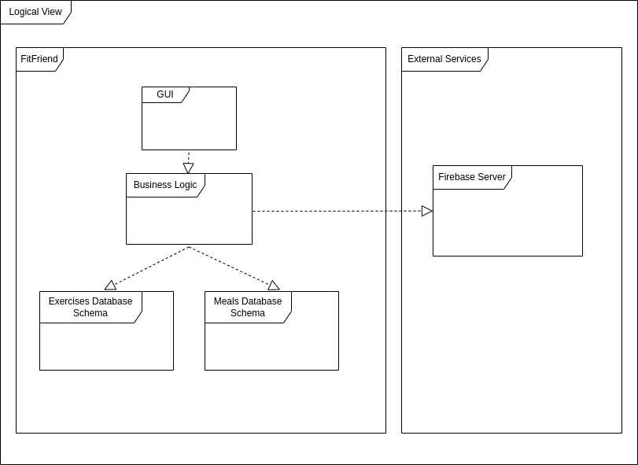
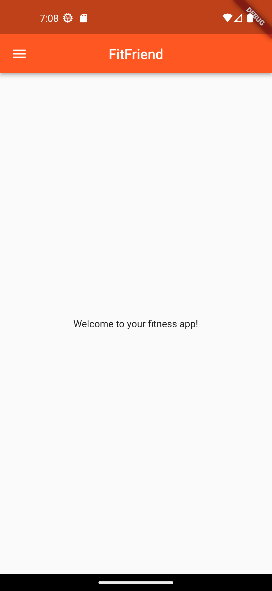
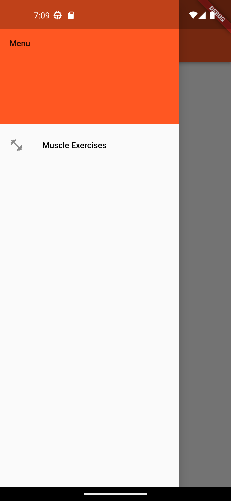
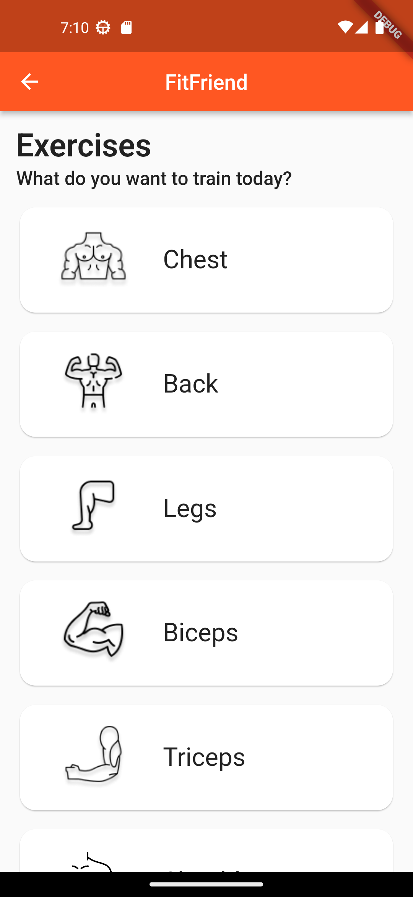

# Architecture and Design

## Logical Architecture

## Physical Architecture

  

## Vertical Prototype

  

### In this first version of the FitFriend app, we have only implemented a sidebar and the "Muscle Exercises" screen. By clicking the icon on the top left, you can open the sidebar, which shows you the different screens you can go to. When clicking on the "Muscle Exercises" option, you are taken to the new screen which shows the user different muscle groups and a few exercises that target them.
