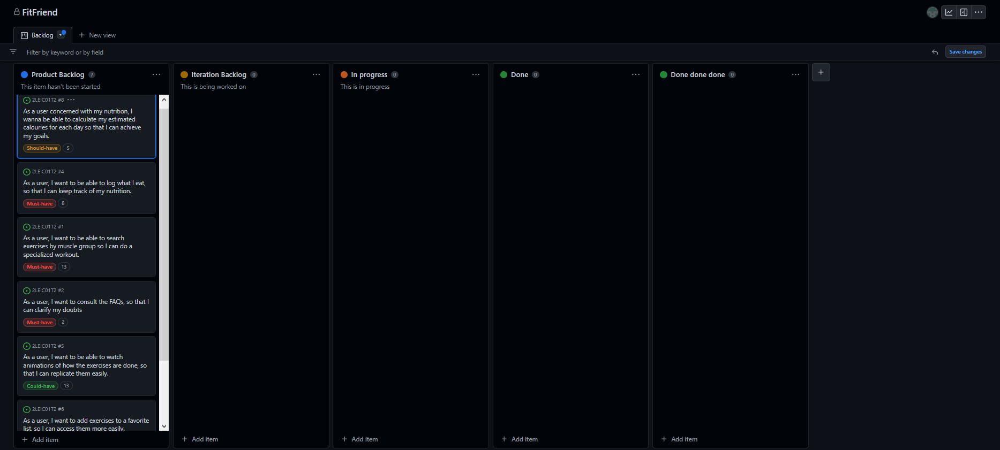
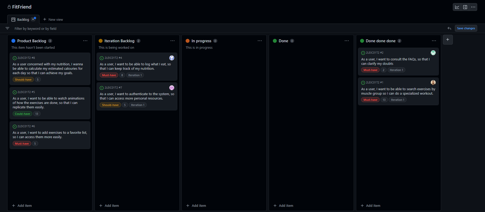

## Sprint 0:

What went well:
We delivered the work on time, and it was distributed evenly.

What we can improve:
Communication outside of class could be better. We're going to meet at least once a week to discuss what we have implemented and be more aware of other team members' messages.

### Project Board: 

## Sprint 1:

What went well:
The board was well used and some user stories are done

What we can improve:
Communication was better but can still be improved. Have a better plan for what we are going to deliver. Work more as a team and keep each other accountable. 

### Project Board:

## Sprint 2:

What went well:
The board was well used and more user stories completed.

What we can improve:
Communication was better but can still be improved. Create more tests for the app, both unit and acceptance tests. Work more as a team and keep each other accountable.

### Project Board:

## Sprint 3:

What went well: 
The board was well used and everything we had planned, despite not completed, is having good progress.

What we can improve: 
Try to improve time efficiency between iterations.

### Project Board: 

