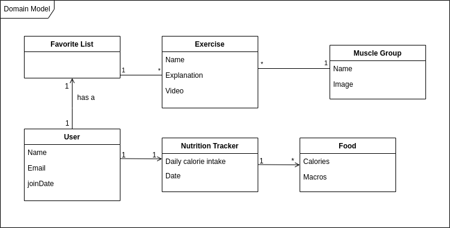

# Requirements

## Domain Model

### User:
    Each user has their own account, represented by their Name, e-mail, and the date they joined.

### Favorite List:
    Each user has a personal favorites exercise list, where they can add the exercises of their choosing.

### Exercise:
    There are various exercises available in the app, defined by their name, a short explanation of what they are, and a video on how to perform them correctly.

### Muscle Group:
    Each exercise is connected to the muscle group it targets, that is represented by a name and an image.

### Nutrition Tracker: 
    The user can log what they ate every day in their personalized nutrition tracker, which has their daily calorie intake and the date at the time of the input.

### Food:
    A simple class representing different foods that the user can eat and log onto their nutrition tracker. 